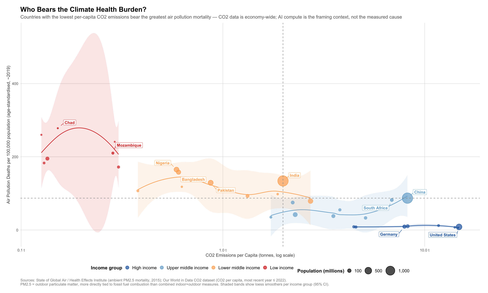
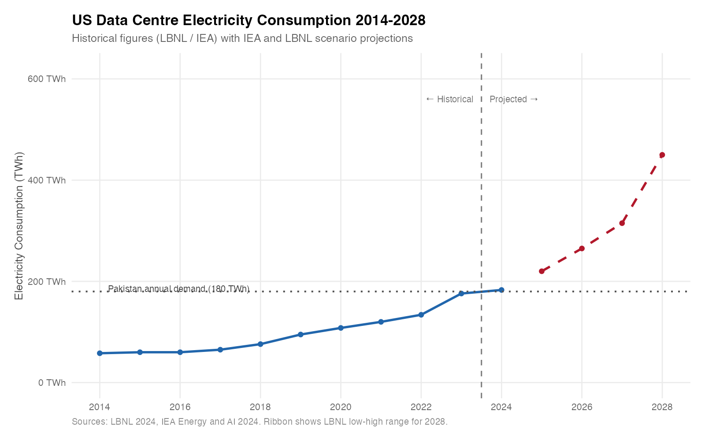
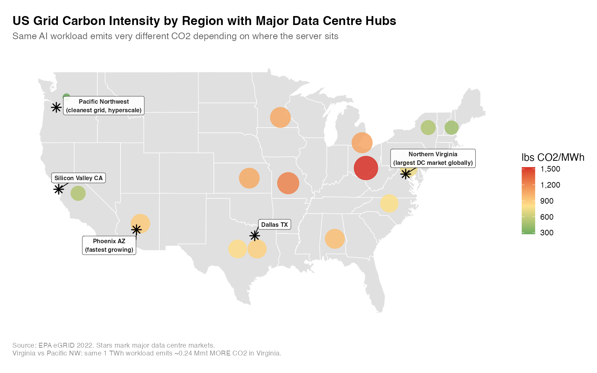

# The Carbon Cost of AI: Data Centre Energy, Emissions, and Global Health Burden

> A descriptive analytics project examining the explosive growth of AI compute infrastructure, its carbon footprint across US electricity grids, and the inequitable global health burden that follows.

---

## Overview

The artificial intelligence revolution is built on hardware — millions of servers running 24/7 in data centres across the United States and the world. Those servers consume electricity at a scale that is reshaping national grids. US data centres consumed an estimated **176 TWh in 2023** — more than the entire annual electricity demand of Pakistan — and projections from the Lawrence Berkeley National Laboratory (LBNL) and the International Energy Agency (IEA) suggest this could reach **315–450 TWh by 2028** as AI workloads accelerate.

That electricity is not clean. The carbon intensity of the grid varies dramatically by geography: a data centre in Virginia's coal-and-gas-heavy grid emits roughly **2.7 times more CO2 per unit of compute** than an equivalent facility in the Pacific Northwest's hydro-and-wind-powered grid. The choice of where to locate a hyperscale facility is not just a real estate decision — it is a carbon decision. When summed across the sector, US data centre operations contributed an estimated **~52 million metric tonnes of CO2 in 2022**, and that share of national emissions is rising. For context, the IEA estimates global data centres consumed roughly 200–250 TWh in 2022 — representing under 1% of global electricity use, but among the fastest-growing segments of demand.

Carbon emissions do not stay where they are produced. They accumulate in the atmosphere, driving a global mean temperature anomaly that has now exceeded **+1.17°C** above the 20th-century baseline. The communities bearing the heaviest health consequences of this warming are not the ones that built the AI infrastructure. Low-income countries — which emit a fraction of the CO2 per capita of wealthy nations — experience **air pollution mortality rates more than 30 times higher** than high-income countries. This project traces that pattern across three layers — server rack to grid to carbon — and contextualises it against a global health burden that falls most heavily on the countries that contributed least to it. The links between layers are correlational, not causally identified.

---

## Data Sources

| Source | What it covers | URL | Access method |
|--------|---------------|-----|---------------|
| **LBNL 2024** | US data centre electricity consumption 2014–2023, water use, projections to 2028 | [lbl.gov/research/united-states-data-center-energy-usage-report](https://eta.lbl.gov/publications/united-states-data-center-energy) | Manual (included in `data/manual/`) |
| **IEA Energy and AI 2024** | Global and US data centre demand projections 2024–2026 | [iea.org/reports/energy-and-ai](https://www.iea.org/reports/energy-and-ai) | Manual (included in `data/manual/`) |
| **EPA eGRID 2022** | CO2 emission rates by US electricity subregion (lbs CO2/MWh) | [epa.gov/egrid](https://www.epa.gov/egrid/download-data) | Hardcoded from summary tables |
| **Our World in Data CO2** | Country-level CO2 emissions, per capita emissions, cumulative emissions, population | [github.com/owid/co2-data](https://github.com/owid/co2-data) | Auto-downloaded via URL |
| **NOAA Climate at a Glance** | Global land+ocean temperature anomaly 1850–2024 vs 1901–2000 baseline | [ncei.noaa.gov/access/monitoring/climate-at-a-glance](https://www.ncei.noaa.gov/access/monitoring/climate-at-a-glance/global/time-series/) | Auto-downloaded via URL |
| **State of Global Air / HEI** | Country-level ambient PM2.5 mortality (outdoor only, 175 countries, 1990–2015) | [github.com/owid/owid-datasets](https://github.com/owid/owid-datasets) | Auto-downloaded via URL (hardcoded fallback: 33-country IHME estimates ~2022) |
| **EIA Electric Power Monthly** | US total electricity consumption by year 2014–2024 | [eia.gov/electricity/monthly](https://www.eia.gov/electricity/monthly/) | Manual (included in `data/manual/`) |

---

## Project Structure

```
carbon-cost-of-ai/
├── README.md
├── .gitignore
├── R/
│   ├── 01_energy_demand.R       # US data centre TWh, grid share, water — 3 plots
│   ├── 02_carbon_footprint.R    # EPA eGRID regional intensity, DC hub map — 2 plots
│   ├── 03_global_emissions.R    # OWID CO2 trajectory, DC share of US emissions — 2 plots
│   ├── 04_climate_indicators.R  # NOAA temperature anomaly, cumulative CO2 scatter — 2 plots
│   ├── 05_health_burden.R       # Air pollution mortality by country/income group — 1 plot
│   └── 06_equity_viz.R          # Centrepiece equity scatter + income group paradox + 2015 vs recent — 3 plots
├── data/
│   ├── raw/                     # Auto-downloaded files (git-ignored)
│   ├── processed/               # Cleaned, merged analysis-ready datasets (health_equity.csv, health_equity_multiyear.csv)
│   └── manual/                  # LBNL/EIA figures hand-entered from reports
└── outputs/
    ├── plots/                   # All 12 PNG visualisations (1600×1000 @ 150 dpi)
    └── tables/                  # Summary CSV tables
```

**Script descriptions:**

- **01_energy_demand.R** — Loads LBNL/EIA manual data, computes data centre share of US grid, and produces three plots: energy trajectory with uncertainty band, grid share bar chart by AI era, and water consumption.
- **02_carbon_footprint.R** — Uses hardcoded EPA eGRID 2022 emission rates to map carbon intensity across US regions and highlight the carbon cost differential between major data centre markets.
- **03_global_emissions.R** — Downloads OWID CO2 data to contextualise US data centre emissions within US national and global totals.
- **04_climate_indicators.R** — Downloads NOAA temperature anomaly series and plots the structural relationship between cumulative emissions and warming.
- **05_health_burden.R** — Downloads OWID air pollution mortality data, merges with CO2 per capita and World Bank income groups, and ranks countries by health burden.
- **06_equity_viz.R** — Produces the centrepiece equity scatter, income group paradox plot, and (when multi-year data is available) a 2015 vs most-recent small-multiples panel showing the gap is persistent over time.

---

## Key Findings

| Finding | Value |
|---------|-------|
| US data centre consumption (2023) | **176 TWh** |
| US data centre consumption projected (2028 midpoint) | **~450 TWh** |
| Data centres as share of US electricity (2023) | **~4.4%** |
| Cleanest major DC grid (Pacific NW) | **273 lbs CO2/MWh** |
| Dirtiest major DC grid (Ohio Valley) | **1,532 lbs CO2/MWh** — 5.6× dirtier |
| Same 1 TWh in Virginia vs Pacific NW | **~0.24 Mmt more CO2** |
| US data centre water use (2023) | **17 billion gallons ≈ 26 million Olympic pools** |
| Global temperature anomaly (2023) | **+1.17°C** above 1901–2000 average |
| Air pollution mortality gap | Low-income countries bear substantially higher **ambient PM2.5 death rates** than high-income countries despite emitting a fraction of the CO2 per capita (2015 data) |

---

## Visualisations

### The Centrepiece — Who Bears the Climate Health Burden?



*Ambient PM2.5 mortality (2015) vs CO2 per capita (most recent year ≤ 2022). Shaded bands show loess smoothers per income group (95% CI). Countries in the top-left quadrant emit little CO2 but face the highest outdoor air pollution mortality. Countries in the bottom-right emit heavily but are shielded by wealth and healthcare capacity.*

---

### 2015 vs Most Recent — Is the Gap Persistent?


*Side-by-side panels showing the same cross-sectional relationship at two time points. A stable pattern across periods indicates structural inequality, not a snapshot artefact. Generated when OWID air pollution data is available with full time series.*

---

### Energy Trajectory



---

### Grid Carbon Intensity Map



---

## Limitations and Future Work

**This is a descriptive correlation study.** The associations shown — between cumulative emissions and temperature anomaly, between income group and health burden — are well-established in the scientific literature, but this project does not perform causal identification. The specific attribution of AI compute to downstream health outcomes requires further epidemiological modelling (a natural extension of this work).

**Data centre emissions are approximations.** The per-sector CO2 estimates use average US grid intensity (0.386 kg CO2/kWh, EPA 2022) applied to aggregate electricity consumption. In reality, many hyperscale operators purchase renewable energy certificates (RECs) or PPAs — the operational vs market-based accounting distinction matters and is not captured here. True additionality is harder to measure.

**Air pollution mortality ≠ climate change mortality exclusively.** The air pollution burden shown includes both fossil fuel combustion (which overlaps with climate emissions) and indoor cooking/heating pollution. Isolating the climate-attributable component requires modelling that is beyond this descriptive scope.

**Sample scope (33 countries).** The equity analysis covers 33 countries determined by data availability — countries with both IHME air pollution estimates and World Bank income classifications present in OWID sources. This convenience sample spans all four income tiers but is not a random or exhaustive global sample. Patterns are illustrative of the cross-income relationship, not a definitive global prevalence estimate.

**Future work:**
- Causal identification: instrumental variable or synthetic control approach linking national emissions trajectories to health outcomes
- Operator-level granularity: hyperscaler-specific PPA-adjusted emissions (Google, Microsoft, AWS)
- Water stress integration: overlay data centre water consumption with regional water scarcity indices
- Projection scenarios: translate LBNL 2028 energy scenarios into carbon and health outcome ranges

---

## Reproducibility

**All external data is pulled automatically** from public URLs (OWID, NOAA) except for the LBNL and EIA figures, which are included directly in `data/manual/` since they require reading from PDF reports.

### Requirements

- R ≥ 4.1
- Internet connection for scripts 03–05 (OWID, NOAA downloads)
- All packages install automatically via `if (!require()) install.packages()` at the top of each script

### Running

```r
# Run scripts in order from the project root:
source("R/01_energy_demand.R")
source("R/02_carbon_footprint.R")
source("R/03_global_emissions.R")
source("R/04_climate_indicators.R")
source("R/05_health_burden.R")
source("R/06_equity_viz.R")
```

Or run all at once:

```r
for (f in list.files("R", pattern = "\\.R$", full.names = TRUE)) {
  message("\n\n========= Running ", basename(f), " =========")
  source(f)
}
```

All 12 plots are saved to `outputs/plots/` as PNG at 1600×1000 pixels, 150 dpi.

---

## Citation

If using this analysis, please cite the underlying data sources listed in the Data Sources table. This project is a secondary analysis of publicly available data.

---

*Built with R, ggplot2, and public data from LBNL, IEA, EPA, Our World in Data, and NOAA.*
